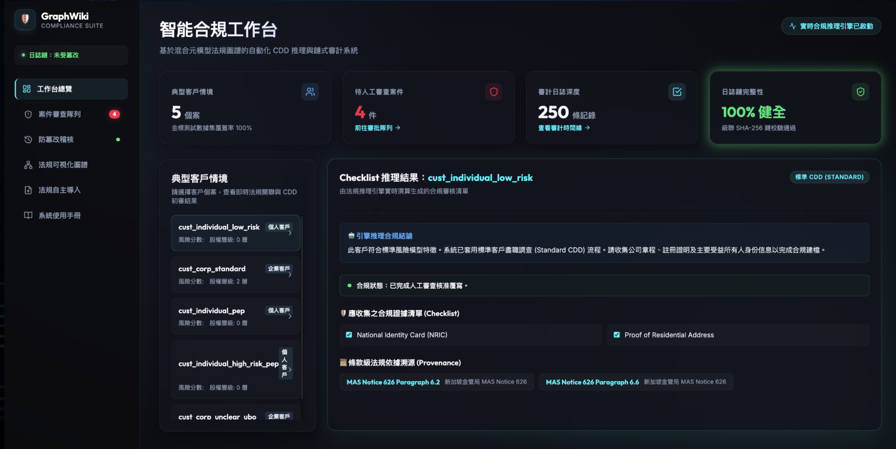
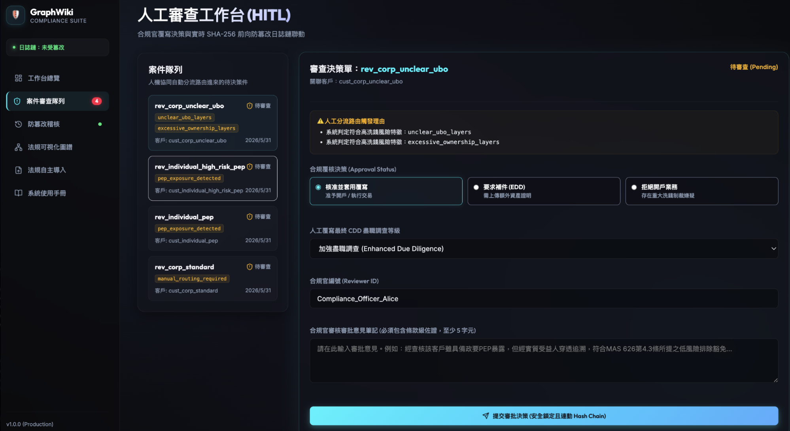
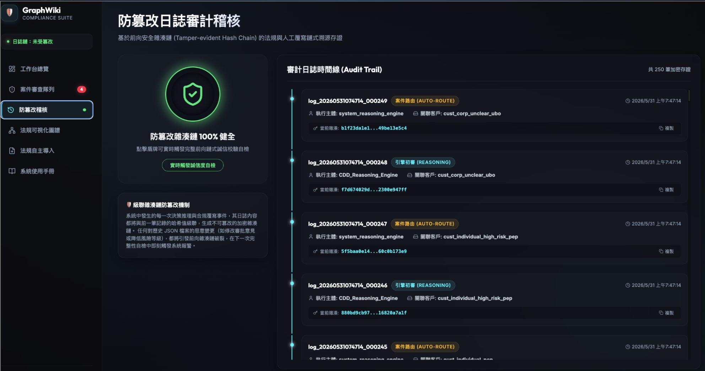
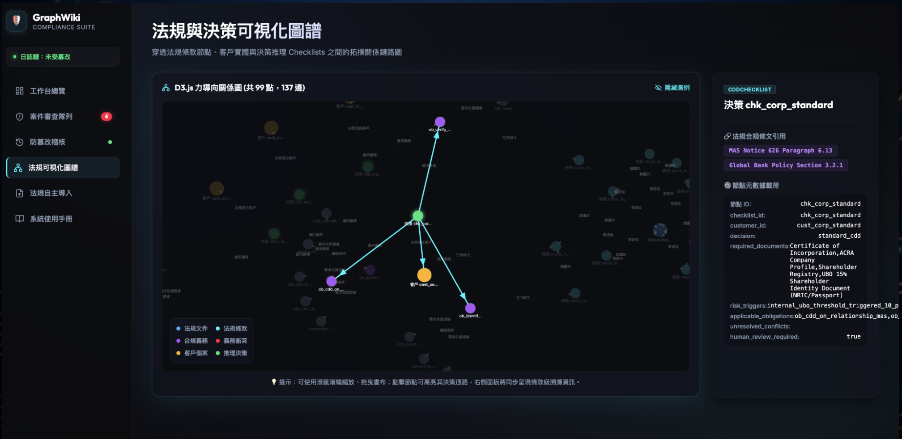
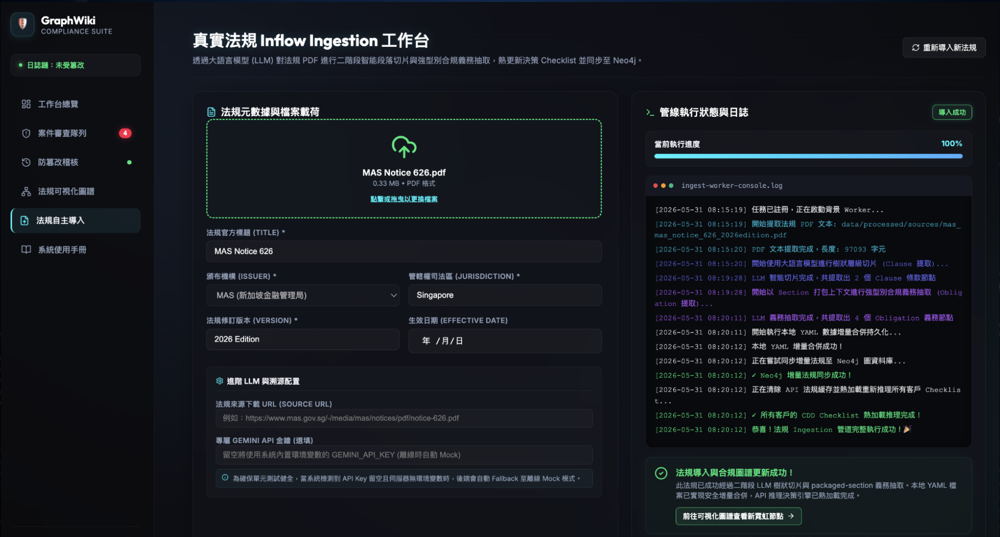

# CDD-GraphWiki

CDD-GraphWiki 是一個為「科技風險管理」課程開發的專案，結合了 AI 輔助的風險工作流程，以及以圖（graph）為基礎的知識組織方式。

它探討的是：如何把合規文件、風險義務、客戶／實體資訊、審查決策、稽核證據，組織成一條可追溯的工作流程，而不是做成一個通用的「上傳 PDF 然後聊天」的應用。

## 30 秒摘要

- **這是什麼：** 一個概念驗證（proof-of-concept）的合規工作流程系統，針對 AML／CDD 盡職調查情境。
- **它展示了什麼：** 結構化的合規知識萃取、以圖為基礎的關係對應、CDD／EDD 檢查清單生成、人工審查路由，以及防篡改的稽核日誌。
- **為什麼重要：** 風險與合規工作仰賴大量零散的文件、要求、實體、證據、簽核和歷史決策。這個專案示範了一種做法——讓 AI 與知識圖譜支援這套流程，同時保持「人的判斷」與「來源出處」清楚可見。
- **目前狀態：** 課程期末專案／可運作的原型，不是正式的法律或合規決策系統。

## 問題

風險與合規審查經常需要在零散的文件、政策、實體紀錄、義務和歷史審查決策之間翻找。這帶來幾個實際的問題：

- 資訊散落在不同的文件和系統裡
- 實體、文件、風險、義務和證據之間的關係很難追蹤
- 人工查找拖慢了合規審查與盡職調查的流程
- 團隊需要的是可解釋、可追溯的檢索，而不是模型給出的黑箱答案
- 高風險的決策仍然需要人工審查、上呈與可稽核性

## 解法

CDD-GraphWiki 把合規知識組織成結構化的物件與圖的關係，再用這套結構去支援風險審查流程。

原型的處理流程如下：

1. 匯入法規或政策來源。
2. 把來源切分成穩定的條文（clause）紀錄。
3. 萃取合規義務與證據要求。
4. 建立一張法規知識圖譜，連結文件、條文、義務、客戶、衝突和檢查清單。
5. 從結構化的客戶情境（customer context）生成 CDD／EDD 檢查清單。
6. 把高風險案件路由到人工介入（human-in-the-loop）的審查。
7. 用防篡改的 SHA-256 雜湊鏈，記錄推理過程、案件路由和審查者的決策。

目標不是取代合規判斷，而是讓資訊檢索、關係對應、審查路由和稽核證據更容易被檢視。

## 與合規／風險管理的關聯

示範的領域是 AML／CDD，但這套設計模式同樣適用於更廣的風險與合規工作流程，包含產品合規的情境。

產品合規團隊通常需要管理：

- 法規要求與標準
- 產品需求與測試證據
- 認證或核可紀錄
- 風險發現與緩解決策
- 文件與產品之間的關聯
- 跨部門的審查歷史

CDD-GraphWiki 展示了在這些情境中可以轉移套用的工作流程概念：

- 文件與需求的檢索
- 風險證據的組織
- 實體／文件／義務之間的關係對應
- 可追溯的 AI 輔助審查支援
- 高風險決策的人工簽核邊界
- 供日後查閱的稽核日誌

## 主要功能

- **結構化的合規資料契約：** 以 JSON Schema 和 Pydantic 模型定義來源文件、條文、義務、客戶情境、衝突、檢查清單、圖節點和稽核日誌。
- **CDD／EDD 決策：** 以規則為基礎，從結構化的客戶情境生成檢查清單，包含所需文件、風險觸發條件、引用出處、衝突，以及人工審查標記。
- **人工介入審查：** 針對高風險或不明確的案件提供審查佇列，審查者的決策與註記都透過 FastAPI 驗證後記錄下來。
- **防篡改稽核軌跡：** 用 SHA-256 雜湊鏈記錄推理過程、案件路由和審查者的覆寫。
- **法規圖譜視覺化：** 以 D3 製作的互動式圖，連結來源文件、條文、義務、衝突、客戶和生成的檢查清單。
- **Neo4j 圖資料庫支援：** 可選的圖資料庫同步，以及用 Cypher 進行 UBO 股權穿透追蹤／循環偵測。
- **PDF 匯入工作流程：** PDF 上傳、文字萃取、LLM 輔助的條文切塊、結構化義務萃取、YAML 合併、快取刷新，以及圖譜／檢查清單更新。
- **評估與治理產出物：** 黃金資料集（gold dataset）、評估工具（evaluation harness）、OpenSpec 需求、ADR，以及系統路線圖文件。

## Demo 與視覺素材

在本機跑起應用後，即可使用線上 demo：

- 前端儀表板：`http://localhost:3000`
- 後端 API 文件：`http://localhost:8000/docs`
- Neo4j Browser：`http://localhost:7474`

既有的視覺素材：


- 架構圖：[`docs/assets/phase_1_10_architecture.png`](docs/assets/phase_1_10_architecture.png)
- 未來發展方向預覽：[`docs/assets/future_development_direction_preview.png`](docs/assets/future_development_direction_preview.png)
- 投影片／第 15-21 頁的 demo 解說：[`docs/presentation_script_pages_15_21.md`](docs/presentation_script_pages_15_21.md)

專案投影片包含更完整的儀表板導覽，涵蓋儀表板、審查佇列、稽核時間軸、圖譜檢視、匯入主控台和使用者指南。

## 畫面截圖

以下是實際運作 demo 的截圖。每個頁面負責合規審查流程中的一個步驟。

### 1. 合規儀表板（Compliance Dashboard）



首頁。最上方顯示一個快速摘要（有多少客戶、有多少案件需要人來看、有多少已經處理完）。你從左邊的清單挑一個客戶，系統就會自動產生一份檢查清單——列出這個客戶需要哪些文件和檢查，並標出每一項是出自哪一條官方法規。

### 2. 人工審查佇列（Human Review Queue）



當案件有風險或不明確時，系統不會自己下決定，而是把案件送到這裡讓真人來審查。審查者讀完案件後，挑一個決定（核准、要求更深入的查核，或駁回），寫下說明理由的註記，然後送出。這讓重要的決定始終由人來掌控。

### 3. 稽核軌跡（Audit Trail）



一份完整的歷史紀錄——所有發生過的事、每一個決定、每一次審查，按順序排列。每一筆紀錄都用數位「指紋」（雜湊）鏈鎖在一起，所以如果有人想偷偷竄改舊紀錄，馬上就會被發現。這就是你日後可以拿出來證明「流程確實有照規矩走」的依據。

### 4. 知識圖譜檢視（Knowledge Graph View）



一張互動式的地圖，呈現所有東西怎麼連在一起——法規、文件、客戶、要求和生成的檢查清單都畫成圓點，再用線標出彼此的關係。你不必在一堆分散的檔案裡翻找，就能看到全貌，並追溯任何一項要求是從哪裡來的。

### 5. 法規匯入主控台（Regulation Ingestion Console）



把新法規加進系統的地方。你上傳一份官方法規文件（PDF），系統會讀取它、把它切成一條條條文，並自動抽出其中的義務。右邊的面板會即時顯示處理檔案的進度。

## 系統架構

```text
Source PDFs / Markdown / Policies
        |
        v
PDF parser and source document records
        |
        v
Clause segmentation and structured obligation extraction
        |
        v
YAML gold / processed datasets + JSON Schema / Pydantic contracts
        |
        v
Regulatory graph: documents, clauses, obligations, conflicts, customers, checklists
        |
        v
CDD / EDD checklist generation
        |
        v
Human review queue + tamper-evident audit log
        |
        v
React dashboard, D3 graph view, FastAPI endpoints, optional Neo4j queries
```

重要的設計邊界：系統把客戶輸入當成結構化的 `CustomerContext` 來處理，而不是當成不受限制的 prompt。高風險的決策一律路由到人工審查。

## 技術堆疊

- **前端：** React 18、TypeScript、Vite、D3、lucide-react
- **後端：** Python、FastAPI、Pydantic、PyYAML、jsonschema
- **匯入：** pypdf、PDF 文字萃取、結構化的條文與義務萃取
- **圖：** 記憶體內的法規圖建構器、D3 視覺化、可選的 Neo4j Community Edition
- **AI／LLM：** 支援 NVIDIA NIM、Gemini 後備方案、供測試與 demo 用的 mock 後備方案
- **資料：** YAML 黃金資料集、處理後資料集、JSON Schema 契約
- **測試：** pytest 後端測試、評估工具、範例 schema
- **部署：** Docker、Docker Compose
- **治理：** OpenSpec 規格／變更，以及 ADR 決策紀錄

## 專案資料

- 論文／書面報告：[Google Docs](https://docs.google.com/document/d/18sSEPHwYYoJUjvCJkYucqSJ-gF9ndiVysm-VFIubL8g/edit?tab=t.0)
- 簡報投影片：[Google Slides](https://docs.google.com/presentation/d/1fYlCTjPTBb8Kf8QJfHVWZ1CbFYJCz8LnEv-pMoTzKeQ/edit?slide=id.g3ec91351360_1_53#slide=id.g3ec91351360_1_53)
- 產品／規格論述：[`docs/SPEC.md`](docs/SPEC.md)
- 系統路線圖：[`docs/system-build-roadmap.md`](docs/system-build-roadmap.md)
- 架構決策：[`docs/adr/`](docs/adr/)
- OpenSpec 契約：[`openspec/`](openspec/)

## 如何執行

### 方式 A：用 Docker Compose 執行

```bash
git clone https://github.com/DancinAndrew/CDD-GraphWiki.git
cd CDD-GraphWiki
cp .env.example .env
docker compose -f deployment/docker-compose.yml up --build
```

接著打開：

- 前端：`http://localhost:3000`
- 後端 API 文件：`http://localhost:8000/docs`
- Neo4j Browser：`http://localhost:7474`
  - 帳號：`neo4j`
  - 密碼：`testpassword123`

預設的 `.env.example` 裡放的是佔位用的 AI 金鑰。即使沒有真正的模型金鑰，核心 demo 資料和許多工作流程仍然可以檢視；但要做真正的 PDF 匯入（含 LLM 萃取）就需要設定好的供應商金鑰。

### 方式 B：後端與前端分開執行

後端：

```bash
python3 -m venv .venv
source .venv/bin/activate
pip install -r backend/requirements.txt
PYTHONPATH=backend uvicorn src.api.main:app --reload --port 8000
```

前端：

```bash
cd frontend
npm install
npm run dev -- --host 0.0.0.0 --port 3000
```

基本 demo 不一定要 Neo4j。如果 Neo4j 不可用，API 會在數個圖工作流程上退回（fallback）到記憶體內的行為。

## 專案目錄導覽

- [`backend/`](backend/) - FastAPI 服務、資料契約、決策引擎、稽核管理器、圖建構器、匯入、評估和測試
- [`frontend/`](frontend/) - React 儀表板，包含合規總覽、審查佇列、稽核時間軸、法規圖譜、匯入主控台和使用者指南
- [`data/gold/`](data/gold/) - 人工整理的黃金資料集，涵蓋來源文件、條文、義務、客戶、檢查清單和衝突
- [`data/processed/`](data/processed/) - 生成或合併後的執行期資料，包含處理後的來源文件和稽核日誌
- [`schemas/`](schemas/) - JSON Schema 契約與範例
- [`docs/`](docs/) - 產品規格、路線圖、ADR、論文筆記、簡報支援素材和視覺素材
- [`openspec/`](openspec/) - 需求規格與封存的實作變更
- [`deployment/`](deployment/) - Docker 與 Docker Compose 設定

## 範例工作流程

1. 打開儀表板，檢視可用的客戶情境。
2. 選一個客戶，查看生成的 CDD／EDD 檢查清單。
3. 檢視所需文件、風險觸發條件、適用義務和引用出處。
4. 打開審查佇列，查看需要人工簽核的案件。
5. 送出審查者的決策與註記。
6. 確認稽核時間軸有記錄下推理過程與審查事件。
7. 打開圖譜檢視，檢視文件、條文、義務、客戶、衝突和檢查清單之間的關係。
8. （選用）透過匯入主控台上傳一份法規 PDF，並監看萃取進度。

## 目前的限制

- 這是課程專案的原型，不是正式的法律意見，也不是已部署的合規平台。
- 主要的 demo 語料偏向 AML／CDD，不是產品合規的語料。
- CDD 決策層刻意設計得受限且以規則驅動，以換取可解釋性。
- 真正的 PDF 匯入時，LLM 萃取仰賴設定好的供應商金鑰。
- 在真正用於合規之前，還需要更嚴謹的檢索評估、人工標註、存取控制和正式的治理機制。

## 未來改進

- 把語料從 AML／CDD 範例擴展到產品合規標準、產品需求文件、認證證據和測試報告。
- 加入證據等級的檢索，結合 BM25、密集檢索（dense retrieval）、GraphRAG，以及字元級（character-span）的引用支援。
- 擴展圖推理，支援產品對需求、需求對測試、風險對證據的可追溯性。
- 強化衝突與落差的裁決，導入 NLI、LLM 輔助的矛盾偵測，以及明確的人工解決流程。
- 加入角色式存取控制（RBAC）、審查者權限，以及正式部署的強化。
- 建立更豐富的截圖／demo 素材資料夾，方便招募者與用人主管快速檢視。

## 免責聲明

CDD-GraphWiki 是一個學習與原型專案，目的是示範 AI 輔助的合規工作流程設計、以圖為基礎的知識組織，以及可稽核性的模式。它不應被當作法律、法規、財務或正式合規的建議使用。
