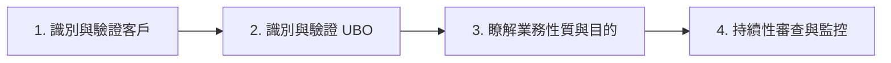

# 客戶盡職調查 (Customer Due Diligence, CDD) 規範

客戶盡職調查 (CDD) 是反洗錢/打擊資助恐怖主義 (AML/CFT) 監管架構的基石。它是指金融機構在與客戶建立業務關係、或進行特定額度的偶發交易時，對客戶背景、身份與實質受益人進行識別、驗證與持續審查的標準流程。

## 1. 適用場景與觸發閾值

根據 **FATF 建議第 10 條** 與 **MAS Notice 626 Paragraph 6.2**，金融機構必須在以下情境下執行 CDD：

1. **建立業務關係 (Establishing Business Relations)**：例如開設帳戶、提供證券託管服務、簽署長期理財合約等。
2. **進行特定偶發交易 (Occasional Transactions)**：
   - **國際標準 (FATF)**：交易金額高於 **USD/EUR 15,000** 時。
   - **新加坡監管 (MAS)**：針對非開戶之偶發客戶，單筆或多筆關聯交易累計超過 **SGD 20,000** 時。
3. **可疑交易跡象**：一旦懷疑客戶涉及洗錢或資助恐怖主義，不論金額大小，必須立即觸發 CDD。
4. **既有資料疑慮**：若懷疑先前取得的客戶身份識別資料真實性或充足性，必須重新執行 CDD。

## 2. 標準 CDD 的四大基本步驟

金融機構在實施標準 CDD 時，必須完整落實以下四個防禦性控制要素：

1. **識別與驗證客戶身份 (Customer Identification & Verification)**：
   - 收集個人客戶的：全名、唯一身份識別號碼（身份證/護照）、住宅地址、出生日期、國籍。
   - 收集法人客戶的：公司名稱、註冊號碼、註冊地址、公司章程、董事名冊。
   - **驗證**：必須使用可靠、獨立的第三方來源文件或政府資料庫（如新加坡的 MyInfo 或 ACRA 註冊資料）核對這些資料。
2. **識別與驗證實質受益人 (UBO Identification & Verification)**：
   - 穿透法人客戶，找出最終控制股權的自然人（>25% 股權閾值），並驗證其身份。
3. **瞭解並獲取業務性質與目的資訊 (Understanding Purpose & Nature)**：
   - 詢問並記錄客戶開戶的真實目的（如日常貿易結算、個人儲蓄、資產配置）與預期交易頻率與規模。
4. **持續性盡職調查與交易 Scrutiny (Ongoing Monitoring)**：
   - 在業務關係存續期間，確保客戶的交易模式與其申報的背景、風險畫像一致。

## 3. 簡化盡職調查 (Simplified CDD)

當客戶風險被評估為極低（例如政府機構、在受嚴格監管且資訊披露透明的證券交易所上市的公司）時，法規允許金融機構適用**簡化 CDD**，例如豁免穿透 UBO，但仍必須對其身份進行基本識別與定期審查。

## 4. 溯源條款對照

- **FATF Rec 10**: [Recommendation 10, Paragraph 2 & 3](file:///Users/andrew-ideaslab/Documents/CDD-GraphWiki/data/gold/clauses.yaml#L9-L32)
- **MAS Notice 626**: [Paragraph 6.2 & 6.6](file:///Users/andrew-ideaslab/Documents/CDD-GraphWiki/data/gold/clauses.yaml#L45-L68)
