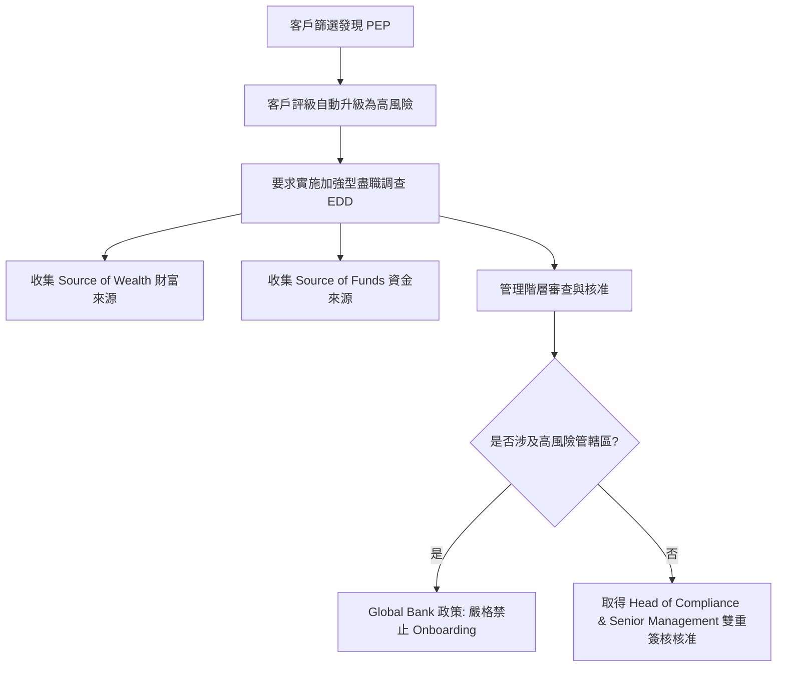

# 政治曝險人物 (Politically Exposed Person, PEP) 審查要求

政治曝險人物 (PEP) 是指在國內、國外或國際組織中被委任擔任重要公共職務的自然人。由於其職務和影響力，PEP 被公認為具有較高可能涉及貪污、賄賂、洗錢及資助恐怖主義的風險。

## 1. PEP 的分類

1. **國外政治曝險人物 (Foreign PEP)**：受託擔任外國重要公共職務的自然人，例如國家元首、政府首腦、高級政治家、高級政府或司法或軍事官員。
2. **國內政治曝險人物 (Domestic PEP)**：受託擔任本國重要公共職務的自然人。
3. **國際組織政治曝險人物 (International Organization PEP)**：受託擔任國際組織（如聯合國、世界銀行、IMF）重要職務的自然人。
4. **關係密切者 (Close Associates & Family Members)**：PEP 的父母、配偶、子女、兄弟姊妹，以及在商業上或控股權上有密切合夥關係的自然人。

## 2. 審查程序與合規要求

一旦客戶（或其 UBO、授權簽署人）被篩選識別為 PEP，金融機構必須將客戶評級調升為**高風險**，並採取以下行動：

### 核心合規檢查點
- **管理層審批 (Senior Management Approval)**：在與 PEP 建立或繼續業務關係前，必須取得高級管理層的正式核准（MAS Notice 626 Paragraph 7.2）。
- **資產與資金來源驗證 (SoW & SoF Verification)**：必須採取合理且積極的步驟，驗證該 PEP 客戶的整體的**財富來源 (Source of Wealth)** 以及交易所使用的**資金來源 (Source of Funds)**。
- **持續監控 (Enhanced Ongoing Scrutiny)**：必須對該業務關係實施加強型持續監控，包括提高交易審查頻率、對交易模式進行深度背景調查。

## 3. 政策衝突與防禦性措施

在新加坡監管下，MAS 允許銀行在採取充分的風險緩釋措施（Senior Management 核准 + EDD）後，與 PEP 建立業務關係。

然而，**Global Bank 內部政策** (Section 4.5.3) 實施了更為嚴苛的防火牆措施：
> [!WARNING]
> Global Bank 嚴格禁止與來自「高風險管轄區」（例如受 FATF 灰名單或黑名單制裁之國家）的 PEP 建立或繼續任何業務關係。對於其他非高風險地區的 PEP，必須通過至少兩層的高級管理層簽核（含 Head of Compliance 的一票否決權）。

## 4. 溯源條款對照

- **MAS Notice 626**: [Paragraph 7.2](file:///Users/andrew-ideaslab/Documents/CDD-GraphWiki/data/gold/clauses.yaml#L81-L92)
- **Global Bank Policy**: [Section 4.5.3](file:///Users/andrew-ideaslab/Documents/CDD-GraphWiki/data/gold/clauses.yaml#L105-L116)
