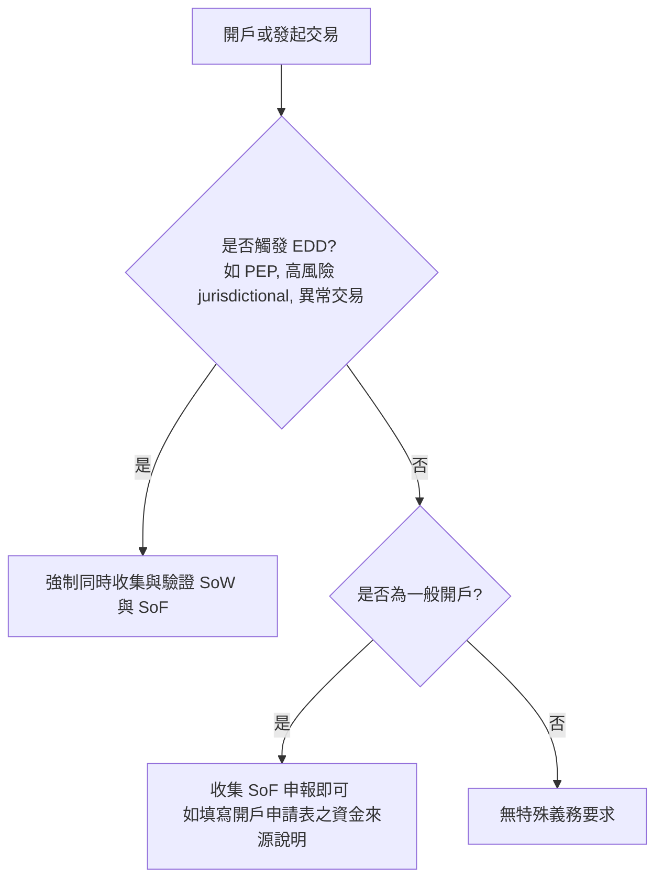

# 資金來源 (Source of Funds) 與財富來源 (Source of Wealth) 驗證要求

在反洗錢與合規審查 (KYC/AML) 中，**資金來源 (Source of Funds, SoF)** 與 **財富來源 (Source of Wealth, SoW)** 驗證是防範洗錢活動中「資金漂白」與「不法資產注入」的最關鍵控制措施。特別是在實施**加強型盡職調查 (EDD)** 時，對 SoF 與 SoW 的審查與驗證是不可逾越的監管紅線。

## 1. 概念定義與對比

這兩個概念在稽核與合規審查中具有本質上的差異：

| 維度 | 財富來源 (Source of Wealth, SoW) | 資金來源 (Source of Funds, SoF) |
|---|---|---|
| **核心定義** | 描述客戶**整體的財富積累途徑與歷史**。說明客戶一生的淨資產是如何合法賺得或獲得的。 | 描述客戶與金融機構進行**特定交易或開戶所使用的具體那一筆資金的直接來源**。 |
| **涵蓋範圍** | 客戶的整個資產組合來源（例如企業創立經營利潤、不動產投資增值、股票投資獲利、財產繼承等）。 | 用於特定開戶存款、匯款或購買理財產品的具體帳戶餘額、資產轉移路徑。 |
| **關注時間跨度** | 長期（數年甚至數十年）。 | 即時/短期（單筆交易或當期流水）。 |
| **常見佐證文件** | 完稅證明、公司審計財務報告、不動產交易合約、遺囑公證書、股權買賣契約等。 | 近期銀行對帳單 (Bank Statements)、薪資單、證券賣出對帳結算單等。 |

## 2. 驗證情境與觸發邏輯

1. **標準 CDD 場景**：金融機構通常僅需在開戶表格中讓客戶「自我宣告」其預計交易的資金來源 (SoF)，無需強制索取第方證明文件。
2. **EDD (高風險/PEP) 場景**：根據 **MAS Notice 626 Paragraph 7.2**，當客戶或其 UBO 屬於政治曝險人物 (PEP) 時，金融機構**必須 (MUST)** 採取合理措施，收集並驗證其 **SoW** 與 **SoF**。

## 3. 防禦性合規查核要點 (Red Flags)

合規官員在審查 SoF/SoW 時，應特別警戒以下異常红旗 (Red Flags)：
- **文件不匹配**：客戶申報其財富來自多年高管薪資，但其稅單與近期銀行對帳單流水顯示其薪資與申報數額有數量級上的落差。
- **第三方代收付 (Third-Party Payment)**：開戶資金來自不相干的境外第三方公司匯入，且客戶無法提供合理的委託協議或商業發票。
- **無合理商業邏輯的資產轉讓**：客戶在短期內獲得了大量來自關聯企業或空殼公司的「諮詢服務費」或「無息借款」。

## 4. 溯源條款對照

- **MAS Notice 626**: [Paragraph 7.2(b)](file:///Users/andrew-ideaslab/Documents/CDD-GraphWiki/data/gold/clauses.yaml#L81-L92)
- **Global Bank Policy**: [Section 4.5.3](file:///Users/andrew-ideaslab/Documents/CDD-GraphWiki/data/gold/clauses.yaml#L105-L116)
