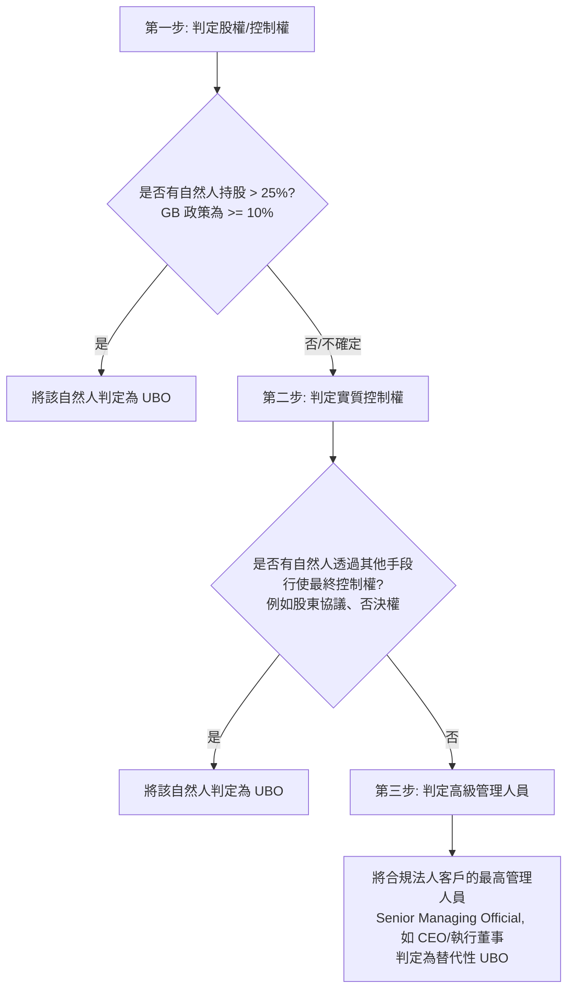

# 實質受益人 (Ultimate Beneficial Owner, UBO) 判定標準

實質受益人 (UBO) 是指最終直接或間接擁有或控制客戶實體的自然人，或代表其進行交易的自然人。在反洗錢/打擊資助恐怖主義 (AML/CFT) 合規框架中，識別與驗證 UBO 是防範法人洗錢、境外空殼公司 layering (分層架構) 的核心環節。

## 1. 核心法規要求

根據 **FATF 建議第 10 條** 與 **新加坡金融管理局 (MAS) Notice 626 段落 6.13**，金融機構必須採取合理措施識別並驗證 UBO：

- **控制股權閾值 (Controlling Ownership Interest)**：
  - **國際與監管標準 (FATF / MAS)**：通常定義為直接或間接持有法人實體 **超過 25% (Shares/Voting Rights > 25%)** 的股權或表決權。
  - **內部高風險防範標準 (Global Bank Policy)**：Global Bank 將此判定閾值收緊至 **10% (Shares/Voting Rights >= 10%)**，旨在對複雜股權結構進行更嚴密地穿透式審查。

## 2. UBO 判定三部曲 (順序判定原則)

金融機構在識別法人客戶的 UBO 時，應遵循以下遞進步驟：

1. **第一步：股權/表決權控制**：識別出通過直接或間接持有股權，達到控制性持股比例的自然人。
2. **第二步：實質控制權判定**：若無人滿足持股比例，但有自然人通過其他手段（例如特殊的股東合夥協議、表決權信託、重大決策否決權等）行使實質控制權，則判定為 UBO。
3. **第三步：高級管理人員替代判定**：如果採取前述步驟仍無法確定任何自然人，則必須將法人客戶中行使最高管理權限的自然人（如 CEO、執行總裁、董事會主席）列為替代性 UBO。

## 3. 溯源條款對照

- **FATF Rec 10**: [Interpretive Note to Recommendation 10, Paragraph 5(b)(i)](file:///Users/andrew-ideaslab/Documents/CDD-GraphWiki/data/gold/clauses.yaml#L33-L44)
- **MAS Notice 626**: [Paragraph 6.13](file:///Users/andrew-ideaslab/Documents/CDD-GraphWiki/data/gold/clauses.yaml#L69-L80)
- **Global Bank Policy**: [Section 3.2.1](file:///Users/andrew-ideaslab/Documents/CDD-GraphWiki/data/gold/clauses.yaml#L93-L104)
