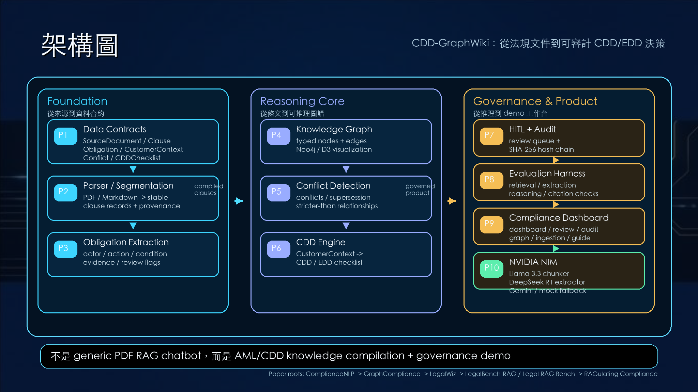

# Phase 1-10 系統建構架構圖頁

用途：插在原 PDF 第 15 頁「解決方案與防禦技術」後、第 16 頁 demo 前，作為 demo 前的系統鳥瞰圖。

## 圖像資產

| 檔案 | 用途 |
| --- | --- |
| `docs/assets/phase_1_10_architecture.png` | 可直接插入簡報的一頁 16:9 PNG。 |
| `docs/assets/phase_1_10_architecture.svg` | 可編輯版本，背景引用 `architecture_background_page15.png`。 |
| `docs/assets/architecture_background_page15.png` | 從原 PDF 第 15 頁擷取的深藍金融科技底圖。 |

## 架構圖設計

這張圖的重點是把 demo 前面的整體建構路線講清楚。視覺上沿用原簡報的深藍金融科技底圖，中央疊一層半透明深色面板，避免原始背景干擾文字。左上角保留「架構圖」主標，右上角補一句「CDD-GraphWiki：從法規文件到可審計 CDD/EDD 決策」。

中間分成三個區塊：

| 區塊 | Phase | 說明 |
| --- | --- | --- |
| Foundation | P1-P3 | 從資料合約、Parser 到義務抽取，建立可追溯的法規資料底座。 |
| Reasoning Core | P4-P6 | 從知識圖譜、衝突檢測到 CDD 推理引擎，形成可推理的合規核心。 |
| Governance & Product | P7-P10 | 透過人工審查、Evaluation Harness、Dashboard 與 NVIDIA NIM 整合，把推理放進可治理 demo。 |

底部保留一句定位：「不是 generic PDF RAG chatbot，而是 AML/CDD knowledge compilation + governance demo」。這句話是報告時的防呆線，避免被老師理解成一般 PDF 問答機器人。

## 第 15A 頁逐字稿

這一頁我會放在 demo 前面，先給大家一張鳥瞰圖。剛剛第 15 頁講的是我們的解決方案方向，這一頁則把整個系統是怎麼做出來的，用 Phase 1 到 Phase 10 串起來。

最左邊是 Foundation。這代表我們不是先做 UI，而是先做資料合約、Parser 和義務抽取。也就是先定義 `SourceDocument`、`Clause`、`Obligation`、`CustomerContext`、`Conflict`、`CDDChecklist` 這些結構，再把 PDF 或 Markdown 法規切成 stable clause records，最後抽出 actor、action、condition、evidence 和 review flags。

中間是 Reasoning Core。這一層把前面的 clause 和 obligation 編成知識圖譜，加入衝突檢測，最後接到 CDD 推理引擎。重點是客戶資料不是 prompt，而是 `CustomerContext`；系統用它去對齊法規義務，產出 CDD 或 EDD checklist。

右邊是 Governance & Product。高風險或模糊案件會進 HITL 人工審查，所有推理和覆寫都寫進 SHA-256 hash-chain audit log；Evaluation Harness 用來拆開檢查 retrieval、extraction、reasoning 和 citation；Compliance Dashboard 則是我們後面 demo 會看到的工作台、審查、日誌、圖譜、導入與使用手冊。最後 NVIDIA NIM 整合是在 ingestion 階段使用 Llama 3.3 做智慧切片、DeepSeek R1 做義務抽取，同時保留 Gemini 和 mock fallback。

所以這張圖要表達的是：CDD-GraphWiki 不是單一模型，也不是 generic PDF RAG chatbot，而是一條從法規文件、結構化資料、圖譜推理，到人工覆核與審計治理的系統鏈。接下來第 16 到 21 頁的 demo，就是把這張圖右半邊的 Dashboard、HITL、Audit、Graph、Ingestion 和 Guide 展示出來。

## 論文來源說法

報告時不要說這些架構想法「來自某一篇論文」。比較準確的說法是：`docs/system-build-roadmap.md` 把多篇論文拆到不同系統部件，形成 CDD-GraphWiki 的建構路線。

| 系統想法 | 來源論文 | roadmap 對應 |
| --- | --- | --- |
| 主幹架構、義務抽取、regulatory KG、policy gap analysis | ComplianceNLP | `docs/system-build-roadmap.md:315`, `docs/system-build-roadmap.md:330-348` |
| Policy Graph / Context Graph 分離，支撐 CDD 決策 | GraphCompliance | `docs/system-build-roadmap.md:316`, `docs/system-build-roadmap.md:350-367` |
| AML / KYC domain grounding、customer risk graph、audit / human review | AI Application in AML | `docs/system-build-roadmap.md:317`, `docs/system-build-roadmap.md:368-383` |
| 義務識別、deontic filtering、addressee / predicate classification | Approaching the AI Act | `docs/system-build-roadmap.md:318`, `docs/system-build-roadmap.md:387-402` |
| 法規文字轉 canonical / executable representation | Legal Requirements Translation from Law | `docs/system-build-roadmap.md:319`, `docs/system-build-roadmap.md:404-420` |
| Ingestion agent、triplet extraction、normalization、GraphRAG QA | RAGulating Compliance | `docs/system-build-roadmap.md:320`, `docs/system-build-roadmap.md:422-439` |
| KG schema design、formal ontology vs open schema 取捨 | Knowledge Graph Representations | `docs/system-build-roadmap.md:321`, `docs/system-build-roadmap.md:441-455` |
| 衝突分類、retrieval-verifiable / retrieval-resistant、人類驗證 | LegalWiz | `docs/system-build-roadmap.md:322`, `docs/system-build-roadmap.md:459-475` |
| Legal retrieval evaluation、minimal citation-ready snippets | LegalBench-RAG | `docs/system-build-roadmap.md:323`, `docs/system-build-roadmap.md:477-491` |
| End-to-end legal RAG evaluation、錯誤歸因 | Legal RAG Bench | `docs/system-build-roadmap.md:324`, `docs/system-build-roadmap.md:493-508` |

另外，`docs/papers_notes/index.md:56-129` 已把 Phase 0 到 Phase 9 對應到論文；README `README.md:42-44` 則補充目前 repo 報告用的完成狀態是 Phase 1 到 Phase 10，包含 Compliance Dashboard 與 NVIDIA NIM 整合。

## 來源證據

| 類型 | 來源 |
| --- | --- |
| Roadmap | `docs/system-build-roadmap.md:528-678` 定義 MVP Build Path 中的 Data Contracts、Manual Gold Dataset、Parser、Obligation Extraction、Wiki、Regulatory Graph、Conflict、CDD Engine、Evaluation Harness。 |
| README | `README.md:42-44` 說明報告用的 Phase 1-10 完成項目：資料合約、Parser、義務抽取、知識圖譜、衝突檢測、CDD 推理引擎、人工審查、Evaluation Harness、Compliance Dashboard、NVIDIA NIM 整合。 |
| Papers | `docs/system-build-roadmap.md:311-324` 與 `docs/system-build-roadmap.md:326-508` 說明論文閱讀順序與各部件來源。 |
| Papers notes | `docs/papers_notes/index.md:56-129` 將開發階段映射到論文指導。 |
| Dashboard | `openspec/changes/archive/2026-05-22-create-compliance-dashboard/design.md:7-34` 描述 FastAPI + React Dashboard、review、graph、audit 架構。 |
| NVIDIA NIM | `openspec/changes/archive/2026-05-22-nvidia-nim-integration/design.md:17-20` 說明 Llama 3.3 chunker、DeepSeek R1 extractor 與環境變數覆寫；`backend/src/extraction/llm_client.py:48-82` 說明 NIM、Gemini、mock fallback。 |
| Demo script | `docs/presentation_script_pages_15_21.md` 第 16-21 頁已分別對應 Dashboard、HITL、Audit、Graph、Ingestion、Guide demo。 |

## 還可以加什麼

1. 架構圖對 demo 頁面映射表：把 P7-P10 對到 PDF 第 16-21 頁，老師會更快理解「總覽圖」和「demo 截圖」的關係。
2. 三篇最核心論文來源頁：只挑 ComplianceNLP、GraphCompliance、LegalWiz，說明主幹架構、CDD graph alignment、衝突與人工驗證。
3. 限制與未來工作頁：說明目前是 demo / 規格化實作，不是正式法律判斷自動化；未來可補 production policy workflow、更多法域、真實合規官標註評估。
