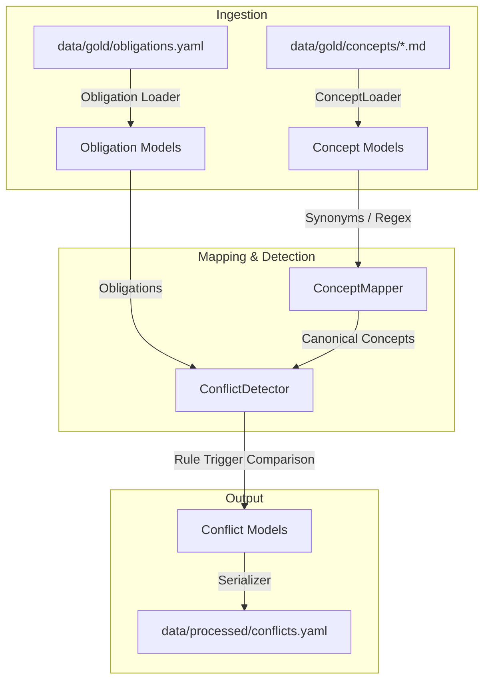

# Phase 5: Association & Conflict Detection Prototype Design

## 1. 系統架構與技術方案 (How)

本階段將實作兩大核心合規引擎元件：`ConceptMapper` (概念映射器) 與 `ConflictDetector` (衝突偵測器)，旨在對反洗錢與客戶盡職調查 (AML/CDD) 的複雜概念與跨政策衝突進行強型別推理與建檔。



### 1.1 `Concept` 強型別模型擴充
在 `src/contracts/models.py` 中新增 `Concept` 類：
```python
class Concept(BaseModel):
    """
    合規概念的強型別模型，用於支持別名同名化與條款級溯源。
    """
    concept_id: str = Field(..., description="Canonical ID, e.g., 'ubo'")
    name: str = Field(..., description="Display name of the concept")
    description: str = Field(..., description="Brief Chinese description")
    aliases: List[str] = Field(default_factory=list, description="Synonym aliases")
    source_clause_ids: List[str] = Field(default_factory=list, description="Clause-level provenance IDs")
```

### 1.2 `ConceptMapper` 別名同名化映射
實作於 `src/association/concept_mapper.py`：
* **`ConceptLoader`**：讀取並解析 `data/gold/concepts/*.md` 檔案，自動提取 `concept_id` (檔名)、`name` (H1 標題) 與 `description` (第一非空段落)。
* **`ConceptMapper`**：
  * 維護別名至 Canonical ID 的對應表。
  * 提供 `map_alias(text: str) -> Optional[str]` 方法：輸入包含別名的文字，將其映射為標稱 `concept_id`。支援不區分大小寫、去空格以及精確/模糊正則匹配。
  * 提供 `enrich_concept(concept_id: str) -> Concept`：返回強型別的完整 `Concept` 對象。

### 1.3 `ConflictDetector` 衝突自動偵測引擎
實作於 `src/association/conflict_detector.py`。
本引擎會動態比對傳入的 `Obligation` 列表，識別以下三類黃金衝突並生成強型別 `Conflict` 實體：

1. **UBO 股權數值衝突 (`conf_ubo_threshold`)**：
   * **偵測邏輯**：當比對的 Obligations 中，均為針對 `beneficial_owner` 的 identify 義務，但在 conditions 中存在不同的百分比門檻（如 `above_25_percent` vs `above_10_percent`）。
   * **輸出實體**：`Conflict` 類，其中 `conflict_type="Numerical"`，`source_clause_ids=["mas626_clause_03", "mock_policy_clause_01"]`。

2. **PEP 管轄區政策反轉衝突 (`conf_pep_jurisdiction`)**：
   * **偵測邏輯**：比對 PEP 處理邏輯，若 MAS 條款 (`ob_pep_edd_mas`) 允許 onboarding PEP (帶有 EDD 及 senior management approval)，而內部政策 (`ob_pep_prohibitions_gb`) 對於特定高風險地區 (high-risk jurisdiction) 的 PEP 採取禁止/限制 (restrict_relationship) 時。
   * **輸出實體**：`Conflict` 類，其中 `conflict_type="PolicyReversal"`，`source_clause_ids=["mas626_clause_04", "mock_policy_clause_02"]`。

3. **偶發交易數值門檻衝突 (`conf_occasional_threshold`)**：
   * **偵測邏輯**：比對偶發交易觸發 CDD 的門檻，FATF (`ob_cdd_on_relationship`) 規定 `15,000` 門檻 (USD/EUR)，而 MAS (`ob_cdd_on_relationship_mas`) 規定 `20,000` 門檻 (SGD)。
   * **輸出實體**：`Conflict` 類，其中 `conflict_type="Numerical"`，`source_clause_ids=["fatf_rec10_clause_02", "mas626_clause_01"]`。

---

## 2. 架構決策關聯 (ADR Alignment)

* **[ADR-0004](file:///Users/andrew-ideaslab/Documents/CDD-GraphWiki/docs/adr/0004-schema-representation-and-python-dataclass-strategy.md) 的混合元模型策略**：
  * 我們新增的 `Concept` 類將使用 `Pydantic` 實作權威代碼模型。
  * 執行 `scripts/compile_schemas.py` 將自動把 `Concept` 模型編譯為 `Concept.schema.json`，作為聲明式契約，實現單一事實來源。
* **[ADR-0003](file:///Users/andrew-ideaslab/Documents/CDD-GraphWiki/docs/adr/0003-start-with-manual-gold-dataset-before-automation.md) 的金標先行**：
  * 衝突偵測引擎產出的 Conflicts，將直接與 `data/gold/conflicts.yaml` 的 Ground Truth 進行字段與內容對齊，確保 F1-score 達 **1.00**。

---

## 3. 預計變更的檔案列表 (Files to Change)

* **[MODIFY]** `src/contracts/models.py`：新增 `Concept` Pydantic 類。
* **[MODIFY]** `src/contracts/__init__.py`：將 `Concept` 納入 `__all__`。
* **[NEW]** `src/association/concept_mapper.py`：別名映射與百科載入器。
* **[NEW]** `src/association/conflict_detector.py`：合規衝突自動偵測引擎原型。
* **[NEW]** `tests/test_association_conflict.py`：針對 Phase 5 的完整自動化單元測試。

---

## 4. 測試與驗證策略 (Verification Strategy)

### 4.1 自動化單元測試
* 在 `tests/test_association_conflict.py` 中實作：
  * **Concept 載入測試**：確認 `ConceptLoader` 能 100% 解析 concepts 中的 Markdown，且通過 Pydantic 校驗。
  * **別名同名化映射測試**：驗證 "UBO", "beneficial owner", "controlling party" 能正確映射為 `ubo`，且非匹配詞彙返回 None。
  * **合規衝突自動偵測測試**：載入 obligations.yaml，傳入偵測引擎，驗證是否精確檢出 3 大衝突，且欄位與金標 100% 對齊。
* 執行命令：`PYTHONPATH=. .venv/bin/pytest tests/test_association_conflict.py -v`

### 4.2 OpenSpec 與 Schema 驗證
* 執行 `python scripts/compile_schemas.py` 產出 `Concept.schema.json`。
* 執行 `openspec validate create-association-conflict-detection-prototype --strict --no-interactive`，驗證 Delta Specs 與計畫是否完全合法。
