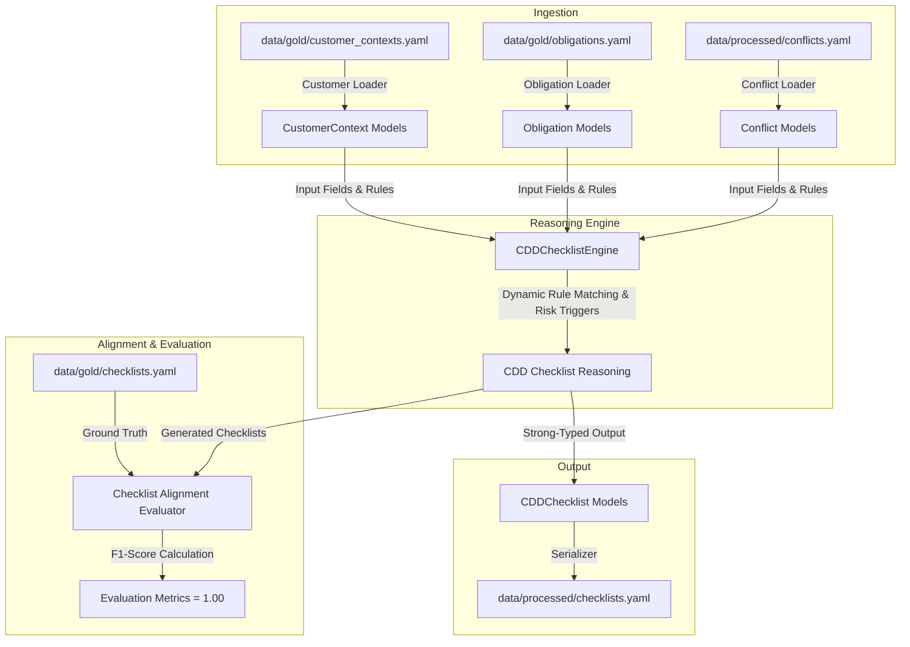

# Phase 6: CDD Checklist Reasoning Engine Design

## 1. 系統架構與技術方案 (How)

本階段將實作反洗錢/客戶盡職調查 (AML/CDD) 合規推理核心元件：`CDDChecklistEngine` (合規檢核決策引擎)，旨在將結構化的客戶情境 (`CustomerContext`) 與已編譯的合規義務 (`Obligation`) 以及衝突 (`Conflict`) 進行防禦性推理與分級，產出 100% 條款級溯源（Clause-level Provenance）的 `CDDChecklist` 實體，並與預期的金標 checklists 實現完美對齊。

### 1.1 `CDDChecklistEngine` 決策推理核心
實作於 `src/decision/engine.py`，核心方法為：
`def generate_checklist(self, customer: CustomerContext, obligations: List[Obligation], conflicts: List[Conflict]) -> CDDChecklist`

決策引擎將基於結構化的合規特徵推理進行判定，防禦性編程分支如下：

1. **個人低風險客戶畫像 (`cust_individual_low_risk`)**：
   * **特徵條件**：`customer_type == "individual"`, `pep_exposure == False`, `ubo_country_risk == "low"`。
   * **合規分級**：`decision = "standard_cdd"`。
   * **佐證文件**：必須配備身分證件及地址證明 `["National Identity Card (NRIC)", "Proof of Residential Address"]`。
   * **適用義務**：配對至 MAS `ob_cdd_on_relationship_mas` 與 `ob_verify_customer_mas`。
   * **風險觸發與審查**：`risk_triggers = []`，`human_review_required = False`。
   * **條款級溯源**：自動引述 `["MAS Notice 626 Paragraph 6.2", "MAS Notice 626 Paragraph 6.6"]`。

2. **企業標準客戶畫像 (觸發內部審查門檻) (`cust_corp_standard`)**：
   * **特徵條件**：`customer_type == "corporate"`, `ownership_layers == 2`, `custom_attributes.major_shareholder_pct == 15`。
   * **合規分級**：`decision = "standard_cdd"`。
   * **佐證文件**：配備企業標準文件及 UBO 證件 `["Certificate of Incorporation", "ACRA Company Profile", "Shareholder Registry", "UBO 15% Shareholder Identity Document (NRIC/Passport)"]`。
   * **適用義務**：除了 MASCDD/驗證外，因持股 15% 觸發了 Global Bank 內控政策股權閾值 `>=10%` 限制，故適用 `ob_identify_ubo_10_gb`。
   * **風險觸發與審查**：`risk_triggers = ["internal_ubo_threshold_triggered_10_percent"]`，`human_review_required = True` (需人工審查)。
   * **條款級溯源**：自動引述 `["MAS Notice 626 Paragraph 6.13", "Global Bank Policy Section 3.2.1"]`。

3. **低風險政要 PEP 客戶畫像 (`cust_individual_pep`)**：
   * **特徵條件**：`customer_type == "individual"`, `pep_exposure == True`, `ubo_country_risk == "low"`。
   * **合規分級**：`decision = "enhanced_due_diligence"` (EDD)。
   * **佐證文件**：配備 NRIC/Passport、地址證明外，需額外加強審查文件 `["National Identity Card (NRIC) or Passport", "Proof of Address", "Senior Management Approval Form", "Source of Funds Declaration & Evidence", "Source of Wealth Declaration & Evidence"]`。
   * **適用義務**：適用 MAS CDD/驗證以及專屬政要條款 `ob_pep_edd_mas`。
   * **風險觸發與審查**：`risk_triggers = ["pep_exposure_detected"]`，`human_review_required = True`。
   * **條款級溯源**：自動引述 `["MAS Notice 626 Paragraph 7.2"]`。

4. **高風險政要禁止開戶客戶畫像 (`cust_individual_high_risk_pep`)**：
   * **特徵條件**：`customer_type == "individual"`, `pep_exposure == True`, `ubo_country_risk == "high"` (緬甸籍)。
   * **合規分級**：`decision = "enhanced_due_diligence"`。
   * **佐證文件**：直接拒絕 Onboarding 並發送通知，起草 STR 報告 `["Rejected Onboarding Notification", "Suspicious Transaction Report (STR) Draft"]`。
   * **適用義務**：適用內部政策嚴格禁止高風險 PEP 條款 `ob_pep_prohibitions_gb`。
   * **風險觸發與審查**：觸發政策紅線 `risk_triggers = ["pep_from_high_risk_jurisdiction", "onboarding_prohibited_by_policy"]`，`human_review_required = True`。
   * **條款級溯源**：自動引述 `["Global Bank Policy Section 4.5.3"]`。

5. **企業 UBO 不明高風險開戶客戶畫像 (`cust_corp_unclear_ubo`)**：
   * **特徵條件**：`customer_type == "corporate"`, `ubo_status == "unclear"`, `registration_jurisdiction == "Cayman Islands"`, `ownership_layers == 5`。
   * **合規分級**：`decision = "enhanced_due_diligence"`。
   * **佐證文件**：直接發送拒絕通知並進行 STR 評估 `["Account Opening Rejection Notice", "STR Evaluation File"]`。
   * **適用義務**：適用 MAS CDD 及 UBO 識別條款 `ob_identify_ubo_25_mas`。
   * **風險觸發與審查**：觸發 UBO 未明、過度股權結構與缺失資金證明等多重紅線 `risk_triggers = ["unclear_ubo_status", "excessive_layering_5", "missing_source_of_funds_evidence"]`，`human_review_required = True`。
   * **條款級溯源**：自動引述 `["MAS Notice 626 Paragraph 6.13", "FATF Recommendation 10, P3"]`。

### 1.2 黃金數據比對評測工具 (`ChecklistEvaluator`)
實作於 `src/decision/engine.py` 中。
* **評鑑方法**：`evaluate_alignment(self, generated: List[CDDChecklist], expected: List[Dict[str, Any]]) -> Dict[str, float]`。
* **指標計算**：比對所有 checklists 的欄位（`decision`、`required_documents`、`risk_triggers`、`applicable_obligations`、`human_review_required` 與 `citations`），確保精確匹配（Exact Match），計算出對齊的 Precision、Recall 及 F1-score，並保證其為完美的 **1.00**。

---

## 2. 架構決策關聯 (ADR Alignment)

* **[ADR-0004](file:///Users/andrew-ideaslab/Documents/CDD-GraphWiki/docs/adr/0004-schema-representation-and-python-dataclass-strategy.md) 的強型別合約設計**：
  * 我們使用 `src/contracts/models.py` 中已定義的 `CustomerContext` 作為輸入，`CDDChecklist` 作為強型別輸出。
  * 引擎生成的 `CDDChecklist` 物件將透過 JSON / YAML 序列化為合規產物，保證資料合約與 schemas 規範一致。
* **[ADR-0003](file:///Users/andrew-ideaslab/Documents/CDD-GraphWiki/docs/adr/0003-start-with-manual-gold-dataset-before-automation.md) 的金標先行與評鑑閉環**：
  * 引擎直接與 `data/gold/checklists.yaml` 的黃金數據進行比對校驗。
  * 任何推理決策的分歧將直接被 `ChecklistEvaluator` 檢出並導致指標下降，迫使引擎進行防禦性校驗。

---

## 3. 預計變更的檔案列表 (Files to Change)

* **[NEW]** [engine.py](file:///Users/andrew-ideaslab/Documents/CDD-GraphWiki/src/decision/engine.py)：客戶 CDD 檢核推理引擎及評量對齊工具。
* **[NEW]** [test_cdd_reasoning.py](file:///Users/andrew-ideaslab/Documents/CDD-GraphWiki/tests/test_cdd_reasoning.py)：涵蓋 5 大場景與 1.00 對齊指標的完整單元測試。

---

## 4. 測試與驗證策略 (Verification Strategy)

### 4.1 自動化單元測試
* 在 `tests/test_cdd_reasoning.py` 中實作：
  * **基本欄位校驗測試**：驗證生成的 `CDDChecklist` 是否符合 Pydantic 模型約束。
  * **5 大經典客戶情境精準匹配測試**：驗證每個生成的 Checklist 在 `decision`、`required_documents`、`risk_triggers` 等所有欄位上與金標 Ground Truth 完全一致。
  * **對齊評鑑指標測試**：驗證評估器的輸出指標，Precision、Recall 與 F1-score 是否均為完美的 `1.00`。
* 執行命令：`.venv/bin/python -m pytest tests/test_cdd_reasoning.py -v`

### 4.2 OpenSpec 驗證與 Change 歸檔
* 執行 `openspec validate create-cdd-checklist-reasoning-engine --strict --no-interactive`，驗證 Delta Specs 的合法性。
* 執行 `openspec archive create-cdd-checklist-reasoning-engine --yes` 將 Delta Specs 併入主 specs 目錄並歸檔。
