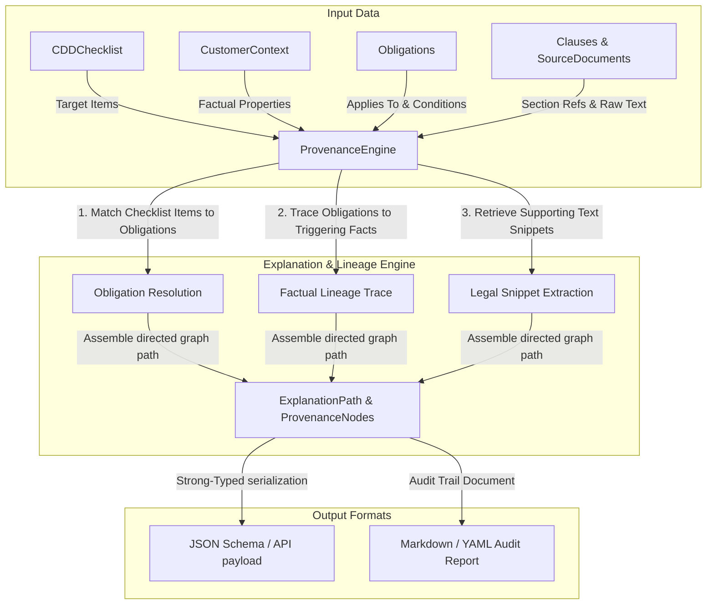

# Phase 7: Explainable Reasoner and Provenance Engine Design

## 1. 系統架構與技術方案 (How)

本階段將實作可解釋合規推理與條款級溯源鏈結閉環核心元件：`ProvenanceEngine` (合規解釋與溯源引擎)，旨在為合規判定決策檢核表 (`CDDChecklist`) 的每一個輸出項目，推理建構出清晰、忠實、可審計的「合規解釋鏈」（Explanation Path），徹底打通客戶情境、義務、法條及原始文件的溯源系譜。



### 1.1 `ProvenanceNode` & `ExplanationPath` 強型別資料合約
在 `src/contracts/models.py` 中擴充定義：

```python
class ProvenanceNode(BaseModel):
    """
    溯源路徑中的單一實體或事實節點。
    """
    node_id: str = Field(..., description="Unique node identifier")
    node_type: Literal["customer_fact", "obligation", "clause", "document"] = Field(
        ..., description="Node classification"
    )
    label: str = Field(..., description="Display label")
    properties: Dict[str, Any] = Field(
        default_factory=dict, 
        description="Factual metadata payload, e.g., raw_text, values"
    )

class ExplanationPath(BaseModel):
    """
    表達某一特定檢核清單要求（如 Senior Management Approval Form）的完整有向合規解釋鏈。
    """
    target_item: str = Field(..., description="The checklist item being explained")
    path_nodes: List[ProvenanceNode] = Field(..., min_length=2, description="Lineage path from fact to document")
    description: str = Field(..., description="Human-readable synthesis explanation")
```

### 1.2 `ProvenanceEngine` 合規解釋與溯源引擎
實作於 `src/decision/provenance.py`，核心方法為：
`def explain_item(self, checklist: CDDChecklist, target_item: str, customer: CustomerContext, obligations: List[Obligation], clauses: List[Clause], documents: List[SourceDocument]) -> ExplanationPath`

回溯推理邏輯：
1. **識別目標要求的合規義務 (Obligation Resolution)**：
   * 分析 `checklist.applicable_obligations`。比對 Obligations 中的 `required_evidence` 與 `review_flags`，查找哪個義務聲明了該 `target_item` 作為必備證據或觸發了該風險。
   * 例如，目標為 `"Senior Management Approval Form"` 時，匹配到適用義務為 `ob_pep_edd_mas`，因為其 `required_evidence` 包含 `senior_management_approval`。
2. **追溯觸發事實 (Factual Lineage Trace)**：
   * 比對該 Obligation 的 `applies_to` 與 `conditions`，匹配 `CustomerContext` 中滿足該條件的具體屬性欄位。
   * 例如，`ob_pep_edd_mas` 的 `applies_to` 限制了 `pep_exposure: true`，從而建立從客戶事實節點到義務節點的關聯。
3. **提取法源條文與明文片段 (Legal Snippet Extraction)**：
   * 根據 Obligation 的 `source_clause_ids`，在 `clauses.yaml` 中檢索出對應的 `Clause` 物件，提取其 `section_ref` 與原始條文明文 `raw_text`。
   * 根據 `Clause.source_document_id` 檢索出 `SourceDocument` 物件，提取其 `title` 與發行機構等元數據。
4. **組裝 ExplanationPath**：
   * 將上述節點依次組裝為有向路徑：`Customer Fact Node` ➔ `Obligation Node` ➔ `Clause Node` ➔ `SourceDocument Node`，並生成簡短的繁體中文合規論述摘要。

### 1.3 審計軌跡報告生成 (Audit Trail Generator)
* 提供 `generate_audit_report(self, paths: List[ExplanationPath]) -> str` 方法，自動將組裝好的解釋鏈格式化為具有清晰視覺箭頭與引用區塊的人類可讀 Markdown 審計軌跡報告。

---

## 2. 架構決策關聯 (ADR Alignment)

* **[ADR-0004](file:///Users/andrew-ideaslab/Documents/CDD-GraphWiki/docs/adr/0004-schema-representation-and-python-dataclass-strategy.md) 的強型別合約設計**：
  * 我們新增的 `ProvenanceNode` 與 `ExplanationPath` 使用 `Pydantic` 實作權威代碼模型。
  * 執行 `scripts/compile_schemas.py` 將自動把新模型編譯為 `ProvenanceNode.schema.json` 與 `ExplanationPath.schema.json`，實現嚴格的事實來源控制。
* **[ADR-0003](file:///Users/andrew-ideaslab/Documents/CDD-GraphWiki/docs/adr/0003-start-with-manual-gold-dataset-before-automation.md) 的金標先行與無幻覺引述**：
  * 引擎直接與 `data/gold/clauses.yaml` 及 `data/gold/source_documents.yaml` 進行無縫鏈結，引述內容 100% 來自已編譯的金標，完全杜絕傳統 AI 系統的隨意生成與法理幻覺。

---

## 3. 預計變更的檔案列表 (Files to Change)

* **[MODIFY]** [models.py](file:///Users/andrew-ideaslab/Documents/CDD-GraphWiki/src/contracts/models.py)：新增 `ProvenanceNode` 與 `ExplanationPath` Pydantic 類。
* **[MODIFY]** [__init__.py](file:///Users/andrew-ideaslab/Documents/CDD-GraphWiki/src/contracts/__init__.py)：將新類納入 `__all__`。
* **[NEW]** [provenance.py](file:///Users/andrew-ideaslab/Documents/CDD-GraphWiki/src/decision/provenance.py)：實作合規解釋與溯源引擎核心。
* **[NEW]** [test_explainable_provenance.py](file:///Users/andrew-ideaslab/Documents/CDD-GraphWiki/tests/test_explainable_provenance.py)：針對溯源引擎、精確引述明文與審計報告導出的完整單元測試。

---

## 4. 測試與驗證策略 (Verification Strategy)

### 4.1 自動化單元測試
* 在 `tests/test_explainable_provenance.py` 中實作：
  * **模型序列化測試**：驗證新強型別模型是否順利通過 Pydantic 校驗。
  * **解釋路徑精確性測試**：驗證政要低風險個人情境下，解釋 `"Senior Management Approval Form"` 的路徑能正確追溯到 `pep_exposure = True`，且法條引述明文與金標 `mas626_clause_04` 100% 一致。
  * **高風險 PEP 禁止 Onboard 解釋測試**：驗證緬甸高風險政要情境下，解釋 `"Rejected Onboarding Notification"` 能回溯至 `ubo_country_risk = high` 與 `ob_pep_prohibitions_gb` 義務。
  * **審計軌跡報告格式測試**：驗證導出的 Markdown 審計報告格式正確，且含有正確的發行機構引用。
* 執行命令：`.venv/bin/python -m pytest tests/test_explainable_provenance.py -v`

### 4.2 OpenSpec 與 Schema 驗證
* 執行 `python scripts/compile_schemas.py` 產出 `ProvenanceNode.schema.json` 等新 Schema 檔。
* 執行 `openspec validate create-explainable-provenance-engine --strict --no-interactive`，驗證 Delta Specs 與計畫是否完全合法。
