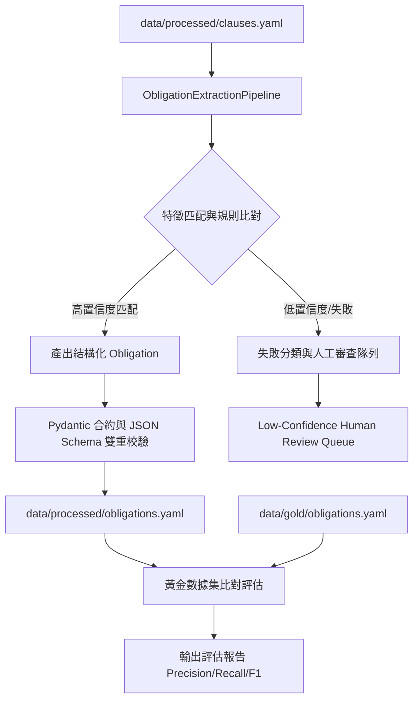

# Technical Design: Create Obligation Extractor Prototype

本設計文件定義了 **Phase 4: Obligation Extractor Prototype** 的具體技術實現方案。本設計完全契合 [ADR-0004](file:///Users/andrew-ideaslab/Documents/CDD-GraphWiki/docs/adr/0004-schema-representation-and-python-dataclass-strategy.md) 的混合元模型策略與強型別合約設計。

---

## 1. 系統架構與資料流 (Architecture & Data Flow)

合規義務抽取管線 (`ObligationExtractionPipeline`) 透過以下多階段對 `Clause` 進行解析、校驗、分類與比對：

---

## 2. 具體實現方案 (Implementation Details)

### 2.1 規則驅動抽取引擎 (`src/extraction/extractor.py`)
我們將實作 `RuleBasedObligationExtractor`，基於法規條款的語意與語法特徵（利用正則表達式、關鍵字密度、條款層級樹路徑）進行結構化資訊匹配：
- **Actor (義務主體)**：如 `financial_institution`、`bank`、`employee`。
- **Action (合規動作)**：如 `identify_and_verify`、`perform_cdd`、`perform_edd`、`prohibit`、`restrict_relationship`。
- **Object (合規對象)**：如 `beneficial_owner`、`customer_identity`、`pep`、`anonymous_accounts`。
- **Conditions (觸發條件)**：從 Clause 的子節點與文字中提取，如 `establishing_business_relations`、`occasional_transaction_above_sgd_5000`。
- **Exceptions (除外條件)**：如除外門檻或豁免條款。
- **Required Evidence (必備合規憑證)**：如 `ubo_declaration`、`shareholder_registry`。

### 2.2 失敗與低信心度分類機制 (Failure Classification)
若條款無法被清晰抽取為義務，引擎將拒絕隨意生成，並進行原因分類：
1. `NON_OBLIGATION_TEXT`：純背景介紹或定義（例如 `fatf_rec10_introduction` 之前的部分純敘述）。
2. `MISSING_CORE_ELEMENTS`：缺少主體（Actor）或關鍵合規動作（Action）。
3. `LOW_CONFIDENCE_THRESHOLD`：匹配特徵過少，信心度低於指定閾值（預設 `0.75`）。
這些失敗物件將被收集並寫入人工審查報告中，歸入 `low_confidence_review_queue`。

### 2.3 黃金數據集評估比對器
評估器將讀取自動抽取的 Obligations 與 `data/gold/obligations.yaml` 進行比對：
- **精準對齊度 (Exact Alignment)**：比對 `obligation_id`、`source_clause_ids` 是否正確關聯。
- **欄位比對 (Field-level Match)**：比對 `actor`、`action`、`object` 的精準度。
- **指標計算**：輸出 `Precision`、`Recall` 與 `F1-Score`，確保自動抽取器在當前 Corpus 上表現強健。

---

## 3. 預計變更的檔案列表 (Files to Change)

### [NEW]
1. **[extractor.py](file:///Users/andrew-ideaslab/Documents/CDD-GraphWiki/src/extraction/extractor.py)**: 抽取器主程式。
2. **[test_obligation_extractor.py](file:///Users/andrew-ideaslab/Documents/CDD-GraphWiki/tests/test_obligation_extractor.py)**: 針對合約、失敗分類與評估指標的單元測試。

### [MODIFY]
1. **[task.md](file:///Users/andrew-ideaslab/.gemini/antigravity/brain/4715f275-5668-4503-957f-b889b1a87ca4/task.md)**: 勾選後續任務。
2. **[walkthrough.md](file:///Users/andrew-ideaslab/.gemini/antigravity/brain/4715f275-5668-4503-957f-b889b1a87ca4/walkthrough.md)**: 追加 Phase 4 完成報告。

---

## 4. 測試策略 (Testing Strategy)

我們將實作以下單元測試，確保品質與穩定性：
1. **Pydantic / JSON Schema 校驗測試**：確保自動抽取的 Obligations 100% 通過 Schema 校驗。
2. **失敗分類校驗**：確保「非義務條款」能被準確分類為 `NON_OBLIGATION_TEXT`，且不會輸出垃圾義務。
3. **評估比對評測**：驗證比對演算法輸出正確的 Precision / Recall / F1 指標。
