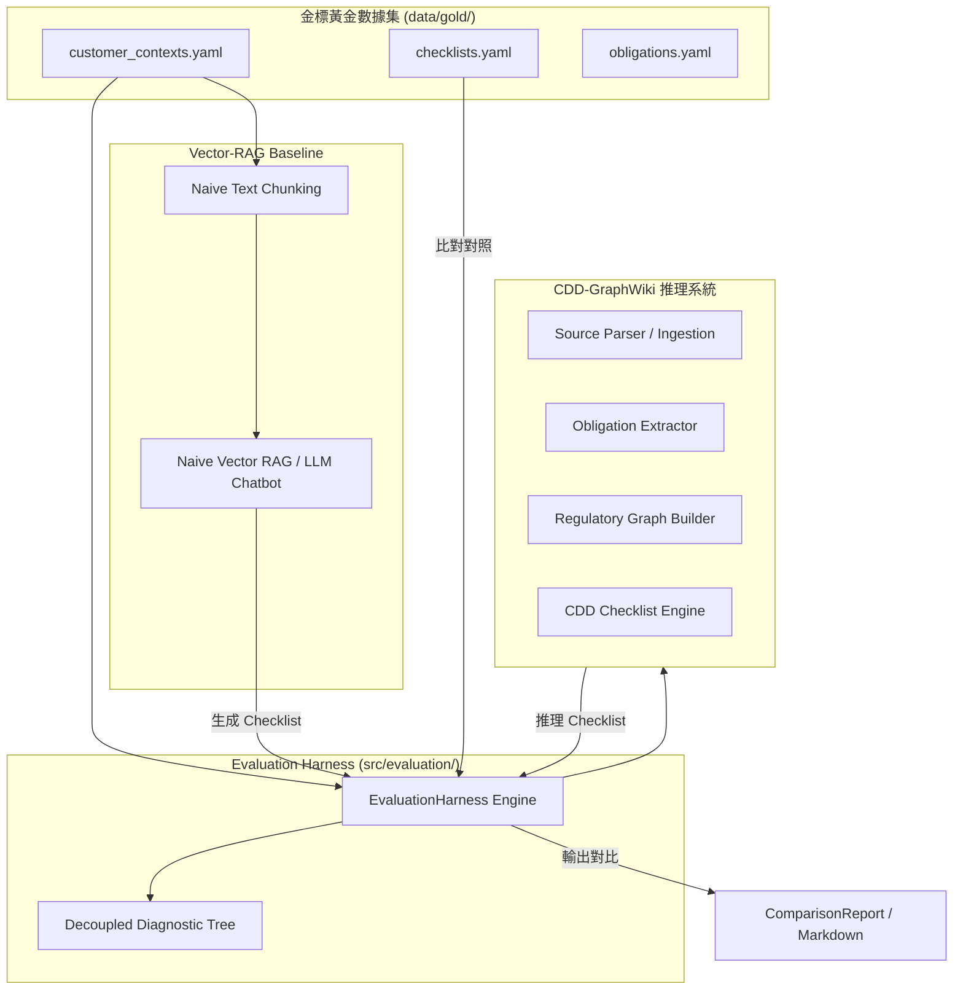

# Design - Phase 9: Evaluation Harness

本設計文檔詳細說明了 **Phase 9: Evaluation Harness (評估框架：Retrieval / Reasoning 分離與對比)** 的技術架構與實作方案。本設計嚴格依循 [ADR-0002](file:///Users/andrew-ideaslab/Documents/CDD-GraphWiki/docs/adr/0002-build-compliance-knowledge-compilation-before-chat-ui.md) 的「合規優先於 Chat UI」與 [ADR-0004](file:///Users/andrew-ideaslab/Documents/CDD-GraphWiki/docs/adr/0004-schema-representation-and-python-dataclass-strategy.md) 的強型別契約設計原則，旨在透過嚴謹的軟體工程指標量化證明 CDD-GraphWiki 的高可靠性。

---

## 1. 系統架構設計

我們將建立一個解耦且高內聚的評估架構，其核心交互與資料流如下所示：

評估核心包含兩個主要技術模組：
1. **`EvaluationHarness` (評估核心)**：負責調度 CDD 推理引擎與 Baseline，將其輸出與 Gold Ground Truth 進行多維度比對，計算 Recall、Precision 與 Accuracy。
2. **`Decoupled Diagnostic Tree` (錯誤歸因診斷樹)**：當推理產出的 Checklist 與金標不一致時，自動回溯執行診斷樹，分析錯誤是起源於 Retrieval、Extraction、Graph 建模、Conflict 處理，還是 Reasoning 邏輯。

---

## 2. 核心技術實作細節

### 2.1 強型別合約模型 (`src/contracts/models.py`)
我們將在合約中新增以下評估用強型別資料模型：
*   `EvaluationMetrics`：記錄單項評估維度的量化指標。
    *   `precision`: `float`
    *   `recall`: `float`
    *   `f1_score`: `float`
    *   `accuracy`: `float`
*   `DiagnosticReport`：描述決策錯誤的根源診斷結果。
    *   `checklist_id`: `str`
    *   `has_error`: `bool`
    *   `error_source`: `Optional[str]` (可選：`retrieval`、`extraction`、`graph_modeling`、`conflict_handling`、`reasoning`)
    *   `diagnostic_details`: `str`
*   `ComparisonReport`：匯總系統與 Baseline 評估對比結果。
    *   `cdd_wiki_metrics`: `Dict[str, EvaluationMetrics]`
    *   `baseline_metrics`: `Dict[str, EvaluationMetrics]`
    *   `diagnostics`: `List[DiagnosticReport]`

### 2.2 評估核心引擎 (`src/evaluation/harness.py`)
實作 `EvaluationHarness` 類，核心方法包括：
*   `evaluate_retrieval(graph, gold_checklists)`：驗證圖譜檢索出的引用條文與義務是否涵蓋金標檢核表中標註的 `citations` (Recall)。
*   `evaluate_extraction(extracted_obligations, gold_obligations)`：比對從法規本文提取出的 obligations 與金標 obligations 在 actor、action、object 與 required_evidence 上的精準度。
*   `evaluate_conflict_detection(detected_conflicts, gold_conflicts)`：驗證衝突檢測引擎的 Precision 與 Recall。
*   `evaluate_checklist_correctness(engine_checklists, gold_checklists)`：驗證 Checklist 決策等級（如 standard_cdd 還是 enhanced_due_diligence）、required_documents 與 risk_triggers 是否完全正確。
*   `check_citation_faithfulness(graph, engine_checklists)`：引用忠實度與幻覺檢查。遍歷檢核表中的 `citations`，驗證所引用的條款是否在 `graph` 或 `clauses` 中真實存在，且文字內容是否吻合，杜絕 LLM 幻覺引用。
*   `run_diagnostic_tree(engine_checklist, gold_checklist, ...)`：執行錯誤歸因診斷樹。
    *   *Step 1*：決策是否不一致？➔ 若是，檢查是否有 `unresolved_conflicts` 漏判？ ➔ 若是，歸因為 `conflict_handling`。
    *   *Step 2*：是否 `required_documents` 有缺漏？➔ 若是，檢查圖譜中對應的 Obligation 是否缺失？➔ 若是，檢查是否在 Ingestion 階段漏檢索了 Clause？➔ 若是，歸因為 `retrieval`；否則檢查是否 Obligation Extractor 漏提取了 required_evidence？➔ 若是，歸因為 `extraction`；否則歸因為 `graph_modeling`。
    *   *Step 3*：若以上皆非，則歸因為邏輯推理 `reasoning`。

### 2.3 向量 RAG Baseline 模擬器 (`src/evaluation/baseline.py`)
實作 `VectorRAGBaseline` 類，模擬傳統的 Simple Vector-RAG chatbot：
*   使用簡化的 Chunking (依固定字數切片) 與 Vector Similarity (基於簡單字詞相似度 TF-IDF 或 Mock Embeddings 來模擬 RAG)。
*   直接使用 LLM 提示詞模版 (Prompt) 呼叫模型，將檢索出的 chunks 直接合成產生 Checklist。
*   Baseline 往往會因為缺乏強型別圖譜、關聯語意合約與雙向溯源，而容易在條款引用上產生「合規幻覺」（如胡亂引用不存在的 Paragraph），或者在企業股東穿透持股比例上因缺乏圖推理而漏判適用義務。

---

## 3. 預計變更檔案列表

我們將採用手術式修改，僅新增評估模組並擴充合約：

*   **[MODIFY] [models.py](file:///Users/andrew-ideaslab/Documents/CDD-GraphWiki/src/contracts/models.py)**：擴充 Pydantic 資料合約，新增評估相關的強型別資料模型。
*   **[MODIFY] [__init__.py](file:///Users/andrew-ideaslab/Documents/CDD-GraphWiki/src/contracts/__init__.py)**：導出評估強型別模型。
*   **[NEW] [__init__.py](file:///Users/andrew-ideaslab/Documents/CDD-GraphWiki/src/evaluation/__init__.py)**：評估模組接口。
*   **[NEW] [harness.py](file:///Users/andrew-ideaslab/Documents/CDD-GraphWiki/src/evaluation/harness.py)**：實作 `EvaluationHarness` 引擎與錯誤診斷樹。
*   **[NEW] [baseline.py](file:///Users/andrew-ideaslab/Documents/CDD-GraphWiki/src/evaluation/baseline.py)**：實作 `VectorRAGBaseline` 對照組。
*   **[NEW] [test_evaluation.py](file:///Users/andrew-ideaslab/Documents/CDD-GraphWiki/tests/test_evaluation.py)**：自動化單元測試。

---

## 4. 測試與驗證策略

*   **100% 自動化單元測試**：在 `test_evaluation.py` 中撰寫測試。
    *   驗證 `evaluate_retrieval`、`evaluate_extraction` 與 `evaluate_checklist_correctness` 的指標計算邏輯完全正確。
    *   驗證幻覺引用檢測機制 (`check_citation_faithfulness`) 能成功識別出偽造或不存在的法規 Citation。
    *   驗證 `run_diagnostic_tree` 的診斷歸因邏輯，手動模擬 Ingestion 漏條文、Extractor 漏證據與推理邏輯錯誤等場景，斷言其能精確定位並歸因錯誤源頭。
    *   驗證與 `VectorRAGBaseline` 的對比評估能一鍵執行並導出結構完整的對比報告。
*   **OpenSpec 驗證**：在封存前執行 `openspec validate create-evaluation-harness --strict --no-interactive`，必須 100% 通過。
