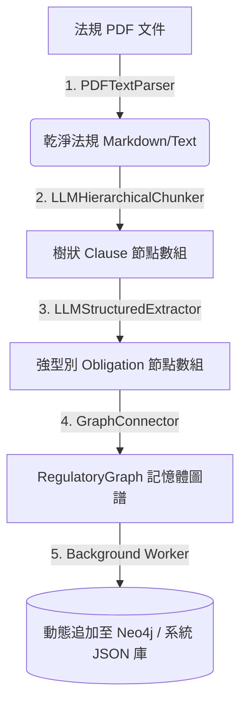

# Design Document: Real Regulatory PDF Ingest & LLM Extraction Pipeline

本設計文件說明了 **Inflow Ingestion Pipeline (法規導入管線)** 的具體技術實現細節、架構決策對齊、模組設計與 API 規格，並為前後端整合提供實作藍圖。

---

## 1. 架構決策紀錄 (ADR) 對齊

本設計完美遵循並延續了 CDD-GraphWiki 專案的架構決策原則：
* **對齊 [ADR-0003](file:///Users/andrew-ideaslab/Documents/CDD-GraphWiki/docs/adr/0003-start-with-manual-gold-dataset-before-automation.md) (先黃金數據集再自動化)**：
  * 在 Phase 1 與 Phase 2 中，我們藉由人工編寫的黃金數據集（MAS 626 核心條款與 FATF Rec 10）確立了合規推理引擎與防篡改審計的正確性。
  * 本設計代表我們正式邁向 **自動化 Ingestion 階段**，但我們將保留原有手動黃金數據集的比對測試模組，並在新管線中加入「與黃金數據集比對評估 (F1 / Precision)」的評量環節，確保自動化抽取質量可量化。
* **對齊 [ADR-0004](file:///Users/andrew-ideaslab/Documents/CDD-GraphWiki/docs/adr/0004-schema-representation-and-python-dataclass-strategy.md) (強型別 Python 數據合約)**：
  * Ingestion 與 Extraction 的核心產出必須 100% 符合併映射至 `src/contracts/models.py` 中定義的 `SourceDocument`、`Clause` 與 `Obligation` 的 Pydantic BaseModel。
  * 我們將藉由大語言模型的 **Structured Outputs (Pydantic Schema JSON Mode)** 來強行保障生成的資料結構合法性，免去傳統二次格式轉譯與驗證。

---

## 2. 系統架構與資料流 (Architecture & Data Flow)

如下圖所示，整個導入管線分為四個核心階段：

### 2.1 階段一：PDF 文本提取 (`PDFTextParser`)
* **技術選擇**：使用純 Python 的 `pypdf` 函式庫，實現輕量化且不依賴外部編譯的 PDF 頁面遍歷與文字串接。
* **清洗策略**：
  * 移除 PDF 多欄與頁首、頁尾標題、版權腳註等重複文字。
  * 合併因分頁導致的斷句與跨行空格。

### 2.2 階段二：LLM 智能層級切片器 (`LLMHierarchicalChunker`)
* **傳統瓶頸**：傳統切片工具只依賴 Token 長度（如 512 tokens 窗口）進行滑動切割，這會徹底粉碎法規的「條款編號引用（如 Section 6(b)(ii)）」，導致合規推理時找不到精準的 Provenance 引用。
* **LLM 智能切割**：
  * 將法規純文字傳給推理 LLM，要求 LLM 自動標記所有的段落邊界，並為每一個 chunk 計算出精確的樹狀 `parent_clause_id` 與穩定的 `section_ref`。
  * 我們設計並優化 System Prompt，讓 LLM 將文字轉換為符合 `Clause` 格式的物件。

### 2.3 階段三：LLM 強型別結構化義務提取器 (`LLMStructuredExtractor`)
* **語意特徵映射**：利用 LLM 識別 Clause 中的實質合規性要求。
* **Pydantic Schema 對接**：
  * 使用 LLM Client 的結構化 JSON 輸出能力（如 API 的 `response_format` 帶入 Pydantic schema：`Obligation`），強制大模型直接返回符合合約的義務物件。
  * 抽取屬性包括：主體（`actor`）、行為（`action`）、對象（`object`）、Fact constraints（`applies_to`）、觸發事實（`conditions`）、例外情況（`exceptions`）以及合規憑證（`required_evidence`）。

### 2.4 階段四：API 層非同步任務設計 (`BackgroundTasks`)
* **超時預防**：LLM 處理長篇 PDF 切割與抽取可能需要數十秒至數分鐘。
* **設計方案**：
  * `/api/v1/ingest/pdf` 接口在接收上傳 PDF 與 Issuer / Version 等元數據後，快速將任務註冊至 FastAPI 的 `BackgroundTasks`，並立即回傳 `202 Accepted` 與隨機 Task ID。
  * 合規官可以在 Dashboard 前端透過 Task ID 進行輪詢（`/api/v1/ingest/task/{task_id}`）來得知導入進度。

### 2.5 深度面試對齊之三大核心決策 (/grill-me 共識)
本設計在與使用者進行了 `/grill-me` 深度架構面試後，確立了以下三大不可妥協的核心實作決策，作為後續編碼的最高指導藍圖：
1. **本地 YAML 增量合併持久化 (輕量無痛儲存)**：
   * **決策**：新導入的 SourceDocument、Clause 與 Obligation 數據在 Pipeline 完成後，將自動與本地現有的 `data/processed/` YAML 檔案進行**增量合併 (Incremental Merge)** 並覆寫儲存，然後熱加載至記憶體圖譜中。
   * **架構優勢**：不需要為此引入繁重的外部資料庫依賴，保持了專案最極簡輕量的特點，且能確保在 Docker 容器重啟後數據不丟失。
2. **`pypdf` 文字提取 + LLM 語意重組 Prompt (版面無依賴修復)**：
   * **決策**：不引入大型且帶有底層 C 編譯依賴的 `fitz (PyMuPDF)` 庫，而是選用純 Python 的 `pypdf` 提取原始文字。對於 PDF 因雙欄或跨頁排版導致的碎裂與雜音，在進入切片前先交由大模型 (LLM) 進行一層**「語意版面重組與拼寫清洗」**。
   * **架構優勢**：極大降低了 Docker 容器部署與 CI/CD 建置的故障風險，同時發揮 LLM 推理的自然語言重組能力，獲得高度連貫且層級分明的法規原文。
3. **區域上下文打包抽取 (Section-level In-Context Extraction)**：
   * **決策**：大模型抽取 Obligation 時，不採用孤立的「逐條 Clause 抽取」（這會導致 Obligation 破碎且丟失 contextual constraints），而是**將整章 (Section) 的所有 Clause 打包為 Context 發送給 LLM**，並要求 LLM 在產出的 Obligation 中，明確填入其所關聯到的所有 `source_clause_ids` 列表。
   * **架構優勢**：使大模型具備全局上下文視角，能完美提取出帶有完整 trigger 條件與 exceptions 的高質量合規義務，同時 100% 確保了 **Clause-level Provenance (條款級溯源)** 的一對多精準對齊。

---

## 3. 預計新增與變更的檔案列表 (Files to Change)

### 3.1 核心後端模組 (Backend Core)
* **`[NEW]` `src/ingestion/pdf_parser.py`**：實現基於 `pypdf` 的 PDF 提取器，提供 `PDFTextParser` 類別。
* **`[NEW]` `src/extraction/llm_client.py`**：封裝對大模型 API 的調用，提供 `LLMClient` 類別，支援生產環境真實呼叫與離線測試環境的 `MockLLMClient`。
* **`[NEW]` `src/extraction/llm_extractor.py`**：使用 LLM 與 `LLMClient` 實現智能 `Clause` 切割與強型別 `Obligation` 抽取。
* **`[MODIFY]` `src/api/v1/endpoints.py`**：
  * 引入 `src/ingestion/pdf_parser.py` 與 `src/extraction/llm_extractor.py`。
  * 新增 `POST /api/v1/ingest/pdf`（上傳 PDF 啟動背景導入任務）。
  * 新增 `GET /api/v1/ingest/task/{task_id}`（輪詢背景任務進度狀態與完成結果）。

### 3.2 前端 Dashboard 模組 (Frontend Console)
* **`[NEW]` `frontend/src/components/IngestionConsole.tsx`**：
  * 提供「PDF 法規檔案導入」卡片，包含 Issuer、Jurisdiction、Version 的手動欄位輸入與拖曳 PDF 上傳控制。
  * 展示 Pipeline 背景執行時的滾動日誌（例如 `[1/4] Parsing PDF...`、`[2/4] Chunking Clauses via LLM...`）。
* **`[MODIFY]` `frontend/src/App.tsx`**：
  * 在左側選單/工作台頁面中新增一個「法規導入工作台 (Ingestion Console)」的分頁切換。

---

## 4. 驗證與測試策略 (Verification & Testing)

### 4.1 自動化單元測試
* **PDF 解析測試 (`tests/test_pdf_parser.py`)**：
  * 使用一個微型的 mock 測試 PDF 檔案，驗證 `PDFTextParser` 能夠正確讀取文字並去除雜訊。
* **LLM 結構化抽取測試 (`tests/test_llm_extractor.py`)**：
  * 使用 `MockLLMClient` 模擬大模型 API 的 JSON 回傳值，驗證當呼叫 `LLMStructuredExtractor` 時，能正確產出符合強型別 `Clause` 與 `Obligation` Pydantic 合約的節點。
  * 驗證背景 API（`/api/v1/ingest/pdf`）的異步回傳碼與 Task 狀態切換。

### 4.2 整合驗證 (Integration & E2E)
* 啟動 Docker 叢集，前端上傳真實法規 MAS 626 PDF 的一部分，觀察 Ingestion 面板中的進度日誌是否順暢。
* 導入完成後，打開「力導向圖譜」，驗證圖譜節點的數量動態增長，且能正確點擊新導入的條款點查看其 Provenance 條款級原始文字。
