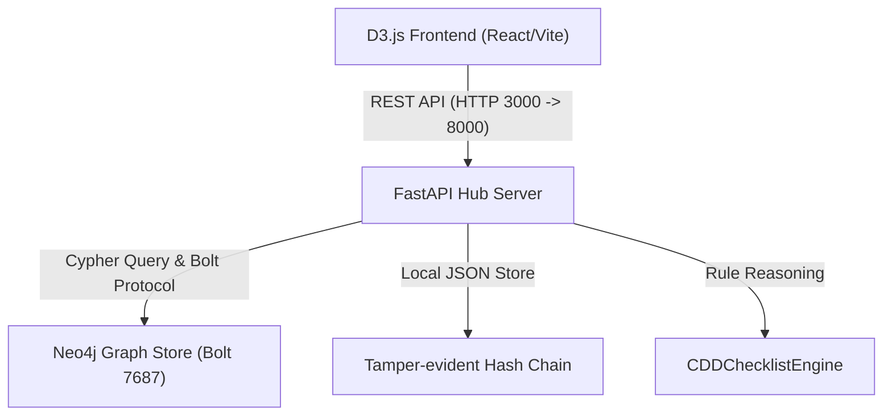

# Design: Neo4j 圖資料庫對接與極深股權 UBO 關係鏈穿透

本設計文檔說明了將 CDD-GraphWiki 合規關係與客戶股權圖譜寫入正式圖資料庫 Neo4j 的技術實現細節。本方案關聯架構決策 [ADR-0004](file:///Users/andrew-ideaslab/Documents/CDD-GraphWiki/docs/adr/0004-schema-representation-and-python-dataclass-strategy.md) 的混合元模型策略，並擴展為具備圖數據穿透能力的架構。

---

## 1. 系統架構圖與元件拓撲

本階段引入 Neo4j 圖資料庫，與 FastAPI、D3.js 前端完美整合，拓撲結構如下：



---

## 2. docker-compose.yml 容器化配置變更

我們將在專案根目錄的 [docker-compose.yml](file:///Users/andrew-ideaslab/Documents/CDD-GraphWiki/docker-compose.yml) 中新增 Neo4j 圖資料庫容器服務，配備本地數據卷以保持數據持久性：

```yaml
  neo4j:
    image: neo4j:5.18-community
    container_name: cdd-graphwiki-neo4j
    ports:
      - "7474:7474"   # Neo4j Browser UI
      - "7687:7687"   # Bolt Protocol for Python backend
    environment:
      - NEO4J_AUTH=neo4j/testpassword123
      - NEO4J_PLUGINS=["apoc"]  # 啟用 APOC 高級圖演算法插件
    volumes:
      - neo4j_data:/data
      - neo4j_import:/import
      - neo4j_plugins:/plugins

volumes:
  neo4j_data:
  neo4j_import:
  neo4j_plugins:
```

同時，在 `backend` 容器的環境變數中，新增 Neo4j 連線參數：
* `NEO4J_URI=bolt://neo4j:7687`
* `NEO4J_USER=neo4j`
* `NEO4J_PASSWORD=testpassword123`

---

## 3. 圖資料庫模型設計 (Graph Schema Design)

我們採用標準的屬性圖模型 (Property Graph Model) 設計，以適配 `SPEC.md` 定義的合規實體關係。

### 3.1 節點定義 (Labels & Properties)
1. **`SourceDocument`**：
   * 屬性：`source_document_id`, `title`, `issuer`, `jurisdiction`, `version`
2. **`Clause`**：
   * 屬性：`clause_id`, `section_ref`, `raw_text`
3. **`Obligation`**：
   * 屬性：`obligation_id`, `actor`, `action`, `object`
4. **`CustomerContext`**：
   * 屬性：`customer_id`, `customer_type`, `registration_jurisdiction`, `pep_exposure`, `ubo_status`
5. **`Conflict`**：
   * 屬性：`conflict_id`, `conflict_type`, `description`
6. **`CDDChecklist`**：
   * 屬性：`checklist_id`, `decision`, `human_review_required`

### 3.2 關係邊定義 (Relationship Types)
* `(:SourceDocument)-[:DEFINES]->(:Clause)`
* `(:Clause)-[:DERIVED_FROM]->(:Obligation)`
* `(:Obligation)-[:APPLIES_TO]->(:CustomerContext)`
* `(:Conflict)-[:REFERENCES_CLAUSE]->(:Clause)`
* `(:CDDChecklist)-[:DECISION_PATH]->(:CustomerContext)`
* **股權穿透邊 `(:CustomerContext)-[:OWNER_OF {share_pct: Float}]->(:CustomerContext|Individual)`**：表示股權控股關係，且帶有加權持股比例 `share_pct`（如 `0.25` 表示 25%）。

---

## 4. 關鍵圖算法與 Cypher 穿透查詢實作

對接 Neo4j 後，我們能輕易以宣告式的 **Cypher** 語言解決金融合規中的最深痛點：

### 4.1 UBO（實質受益人）多層股權穿透與持股比例加乘計算
若要尋找指定法人客戶 `customer_id` 的所有實質受益人（個人，且直接或間接加乘持股大於等於 10%）：

```cypher
MATCH path = (c:CustomerContext {customer_id: $customer_id})-[:OWNER_OF*1..10]->(u:Individual)
WITH u, path, 
     reduce(weight = 1.0, r IN relationships(path) | weight * r.share_pct) AS effective_share
WHERE effective_share >= 0.10
RETURN u.customer_id AS ubo_id, 
       u.pep_exposure AS is_pep, 
       effective_share AS final_percentage,
       [n IN nodes(path) | n.customer_id] AS holding_path
```

### 4.2 控股關係鏈自動環路檢測 (Ownership Loop & Circular Control Detection)
為防範交叉持股規避申報，自動尋找控股環路：

```cypher
MATCH path = (c:CustomerContext)-[:OWNER_OF*2..6]->(c)
RETURN [n IN nodes(path) | n.customer_id] AS loop_nodes, 
       length(path) AS loop_depth
```

---

## 5. 後端軟體元件與測試策略

### 5.1 第三方依賴 Consent
我們需要引入 `neo4j>=5.18.0`（Python 官方驅動），已在設計階段向使用者聲明並尋求批准。

### 5.2 後端模組結構
* `src/graph/store.py`：封裝 `GraphDatabase.driver` 初始化與 Session 執行 API。
* `src/graph/sync.py`：將 `RegulatoryGraph` 轉換為對應的 Cypher `MERGE` 陳述式，並在初次啟動時自動同步。

### 5.3 測試驗證方案
* **單元測試**：使用 Python 的 `unittest.mock` 模擬 Neo4j 驅動的 Session 和 Transaction 執行。
* **集成測試**：在本地 Docker 環境中啟動真實的 Neo4j 進行穿透計算與環路偵測驗證，測試腳本位於 `tests/test_graph_db.py`。
